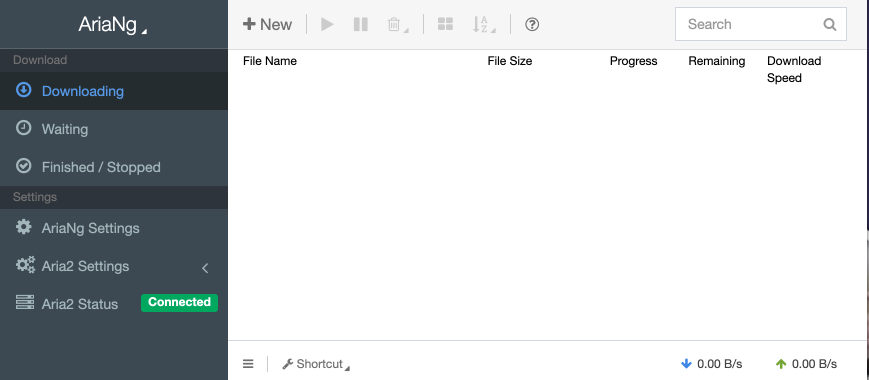

# Aria2 + AriaNG

[](https://hub.docker.com/r/isayme/aria2)


Docker image for Aria2 with Web UI AriaNG.

[aria2 - The ultra fast download utility](https://github.com/aria2/aria2)

[AriaNG - a modern web frontend making aria2 easier to use](https://github.com/mayswind/AriaNg)

# Screenshoot



# Docker Compose
```
version: '3'

services:
  aria2:
    container_name: aria2
    image: isayme/aria2:latest
    ports:
      # aria2 rpc port
      - "6800:6800"
      # web UI port
      - "6900:80"
    volumes:
      # aria2 config file
      - ./config/aria2/aria2.conf:/etc/aria2/aria2.conf
      # location of download files
      - /volume2/HD1/download/:/download
    restart: always
```
